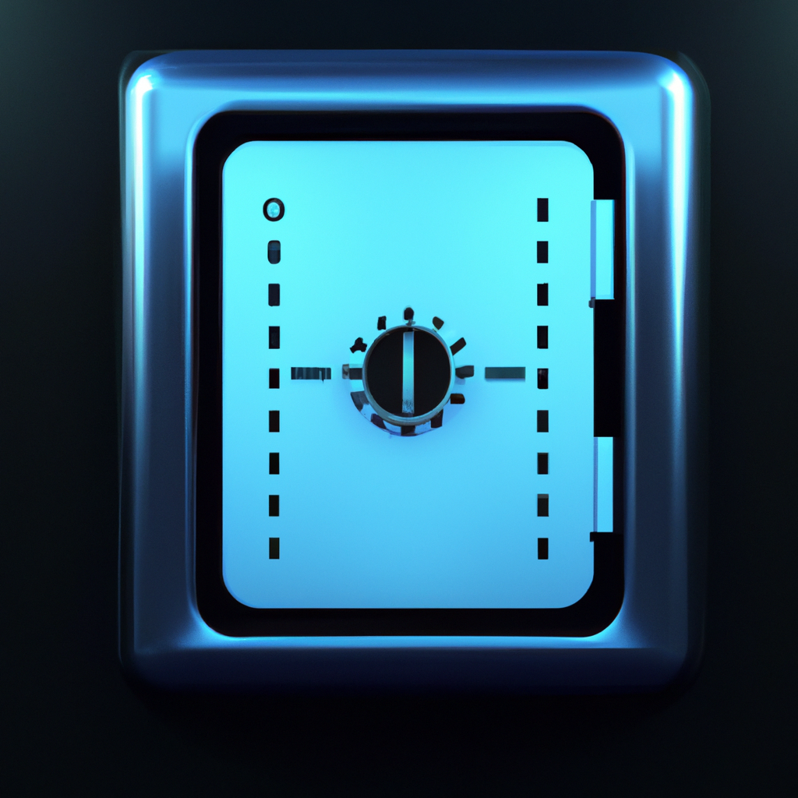

# SafeBox

SafeBox is a secure, modern desktop application for managing sensitive credentials such as bank accounts, application logins, and more. Built with Electron, React, and Material UI, it provides robust encryption, a user-friendly interface, and advanced features for personal credential management.

## Features

- **Bank Account Credential Management**: Store, view, and edit bank account details securely.
- **Application Credential Management**: Manage logins for various applications with password masking and copy-to-clipboard.
- **Strong Encryption**: All sensitive data is encrypted at rest using AES-256-GCM via a user-provided encryption key.
- **User Registration & Login**: Secure onboarding with strong password and encryption key requirements.
- **Workspace Folder**: Choose a custom folder for storing your encrypted data files.
- **Theme Switching**: Toggle between light and dark metallic themes for a modern desktop look.
- **Drawer Menu & Breadcrumbs**: Easy navigation with a side drawer, breadcrumbs, and quick access to Settings and Logout.
- **Settings Panel**: Change your workspace folder path and encryption key at any time.
- **Material UI DataGrid**: Modern, responsive tables with masked/copyable fields and clickable URLs.
- **Cross-Platform**: Runs on Windows, macOS, and Linux.

## Security
- All credential data is encrypted using AES-256-GCM with a key derived from your encryption key (never stored in plaintext).
- Encryption and decryption are handled in the Electron main process using the `StrongCrypto` class.
- Files are only decrypted in memory when needed.

## Getting Started

### Prerequisites
- Node.js (v18 or later recommended)
- npm or yarn

### Installation
1. Clone the repository:
	```sh
	git clone https://github.com/CommunityCodeHub/safebox.git
	cd safebox
	```
2. Install dependencies:
	```sh
	npm install
	# or
	yarn install
	```
3. Start the application in development mode:
	```sh
	npm run dev
	# or
	yarn dev
	```

### Build for Production
```
npm run build
# or
yarn build
```


### Usage
- On first launch, register a new user with a strong password, workspace folder, and encryption key.
- After login, use the tabs to manage bank and application credentials.
- Use the drawer menu (top left) for Settings and Logout.
- All data is stored encrypted in your chosen workspace folder.

## Screenshots

### Main UI


> Want to contribute more screenshots? Please add them to `src/assets/images/` and update this section!

## File Structure
- `src/app/` - React components (UI, forms, settings, etc.)
- `src/main/` - Electron main process (IPC handlers, file management, encryption)
- `src/cryptography/cryptoUtils.ts` - StrongCrypto class for AES-256-GCM encryption/decryption
- `src/entities/` - TypeScript interfaces and constants

## Encryption Details
- **Algorithm**: AES-256-GCM
- **Key Derivation**: SHA-256 hash of user-provided encryption key
- **IV**: 12 bytes random per encryption
- **Auth Tag**: Stored with each encrypted payload

## Contributing
Pull requests are welcome! For major changes, please open an issue first to discuss what you would like to change.

## License
[MIT](LICENSE)

## Disclaimer
SafeBox is provided as-is. Always remember your encryption key—without it, your data cannot be recovered.
